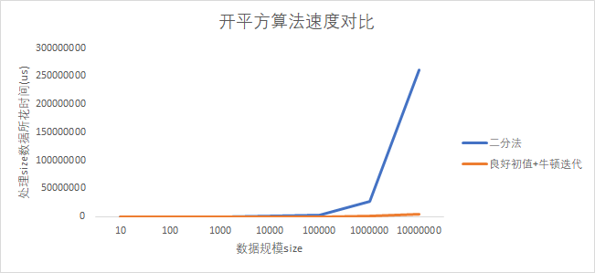

# 记录
## 迭代部分
### 二分法
*时间复杂度：O(logn)*
很容易切入题目，需要注意精度收敛要求(epsinon)
以及上下界的选取
### fast inverse square root
*时间复杂度：O(1)*
要理解该算法的几个重要公式(思想):
#### IEEE 单精度浮点表示以及公式推导
对于一个单精度浮点数y可以表示为：
```
y = 2^e*(1+m)
```
*e为二进制表示的阶码，m为尾数值域[0,1)*
其整数表示:
```
Y = EL + M

```
```
E = e + B
L = 2^23
M = m*L
B = 127
```
作对数变换：
```
logy = e + log(1+m)
```
*由于log(1+m)值域也为[0,1)*
```
logy = e + m + x
```
代入Y:
```
logy = Y/L - (B - x)
```
要求y' = 1/sqrt(y),即求:
```
logy' = -0.5*logy
```
所以
```
Y' = 1.5L(B-x) - 0.5Y
```
*1.5L(B-x) = 0x5f3759df*
### 速度对比

可以看出当数据量变大时，O(1)的fast inverse square root算法所消耗的时间远小于O(logn)的二分法
## 疑问部分
## 不足
### 参考文献/文章
维基百科:fast inverse square root


